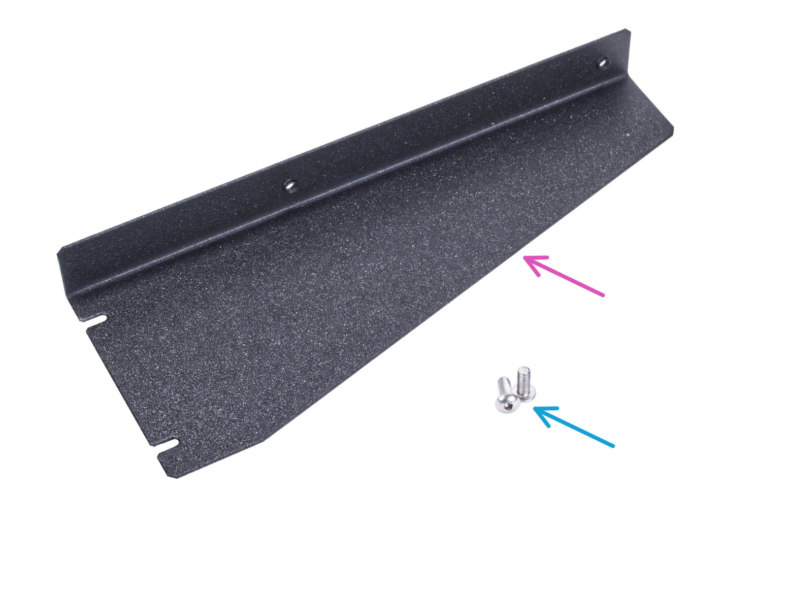

# prusa-mk3-frame-support

A printable version of the Prusa MK3(S+) frame support...in case you lose yours like I did.

This is a scad implementation of the bracket for the Prusa MK3(S+) frame support if you're missing this thing:



## Files

- `frame_support.scad` — parametric source; every dimension is a named variable at the top.
- `frame_support.stl` — ready to print.

To re-export after changing a parameter:

```sh
openscad -o frame_support.stl frame_support.scad
```

## Dimensions

The printed part keeps the sheet-metal bracket's footprint and mounting points, and
replaces the thin L-profile with a pocketed, ribbed block.

|                      |                                                                                             |
| -------------------- | ------------------------------------------------------------------------------------------- |
| Footprint            | 80 mm wide at the slotted end, tapering to 40 mm over 206 mm length (taper starts 35 mm in) |
| Height               | 22.2 mm (the original flange height)                                                        |
| Floor / walls / ribs | 5 mm                                                                                        |
| Slots                | 2 × 3.3 mm wide (M3), 54 mm apart, open at the wide end                                     |
| Side-wall holes      | 2 × Ø4.5 mm (M4), 117 mm apart, 11.2 mm up, with Ø16 mm head clearance on the inside        |
| Chamfers             | 4 mm × 45° where pocket floors meet the walls; 0.5 mm on the slot edges at the bed          |

## Printing

Print flat-face down, as modelled; no supports are needed.
